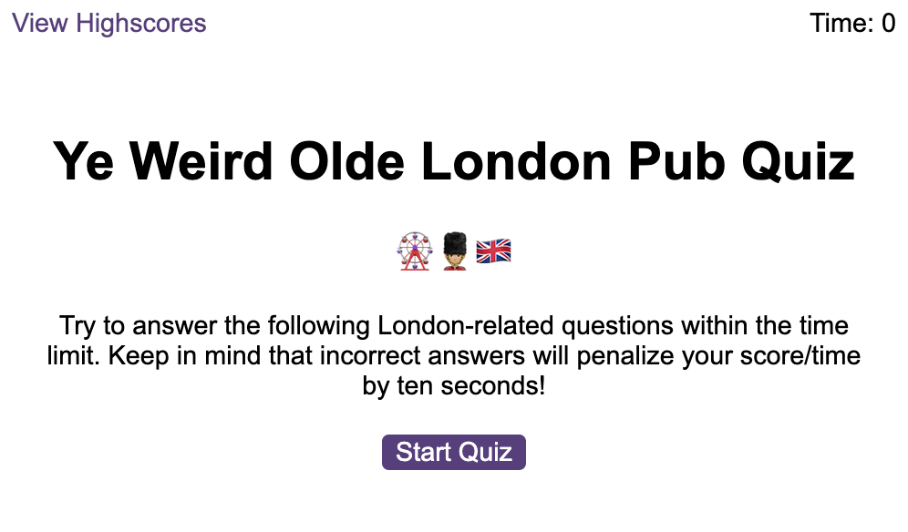
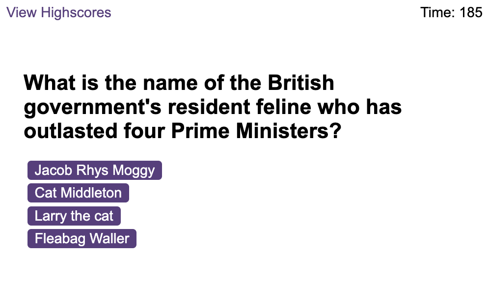
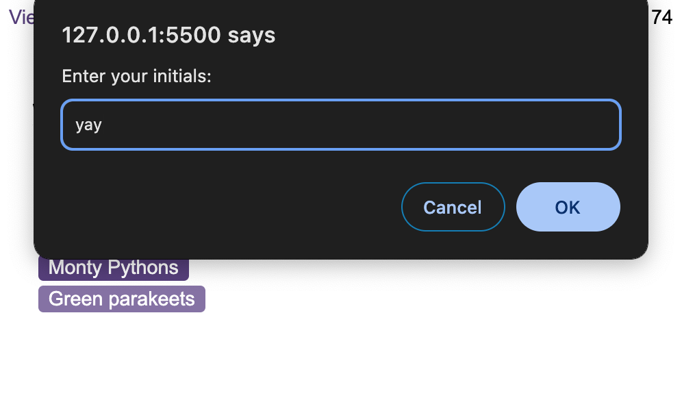
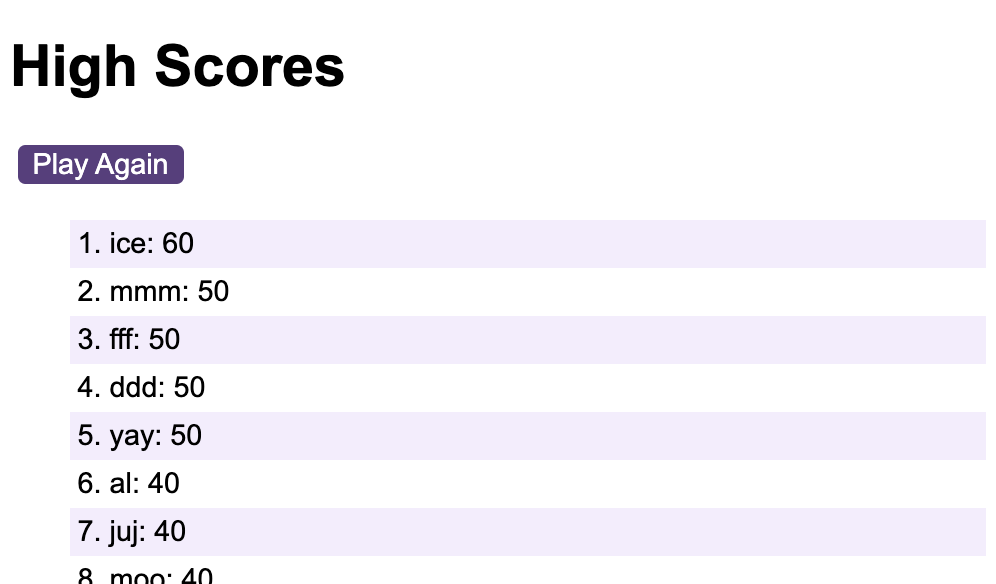

# Ye Weird Olde London Pub Quiz

## Description
A timed coding quiz with multiple-choice questions covering weird facts about my adopted city, London.

## Usage
Quiz rules:
*Click the start button so the timer starts and the first question appears.
  * Questions contain buttons for each answer. The correct answer has a tinkling sound.
  * When the answer is clicked, the next question appears
  * If the answer clicked is incorrect the clock loses 10 seconds and you'll hear an annoying buzzer sound 
* The quiz ends when all questions are answered and the timer reaches 0.
  * When the game ends, it should display your score and you can save your initials to see your rankings in the scoreboard paage.
  

## Deployment
Link to the deployed application 
[Ye Weird Olde London Pub Quiz] (https://codeswitchstudio.github.io/London-code-quiz/)

## Screenshots

## Credits

Thank you to our bootcamp instructor Laura Cole, Student Success Advisor Jesse Pacheco, our pod TA Kimberly Rodriguez, and my patient tutors Ashton Foston and Samuel Cordova.

Quiz Content:
[15 Unusual Facts about London] (https://studentsunionucl.org/index.php/articles/15-unusual-facts-about-london)
[Rudest London Underground Stations] (https://www.mylondon.news/news/zone-1-news/19-rudest-london-underground-station-17631098)

Sound Effects: 
"Correct" Sound Effect from [Pixabay] (https://pixabay.com/?utm_source=link-attribution&utm_medium=referral&utm_campaign=music&utm_content=6347)
"Incorrect" Sound Effect also from [Pixabay] (https://pixabay.com/?utm_source=link-attribution&utm_medium=referral&utm_campaign=music&utm_content=6268))

References:
[Stackoverflow] (https://stackoverflow.com/questions/24644373/next-button-after-correct-answers-on-quiz)
[Free Code Camp] (https://forum.freecodecamp.org/t/simple-javascript-quiz-problem/291032/4)
[Chat GPT] (https://chat.openai.com/)

## License
MIT License

Permission is hereby granted, free of charge, to any person obtaining a copy
of this software and associated documentation files (the "Software"), to deal
in the Software without restriction, including without limitation the rights
to use, copy, modify, merge, publish, distribute, sublicense, and/or sell
copies of the Software, and to permit persons to whom the Software is
furnished to do so, subject to the following conditions:

The above copyright notice and this permission notice shall be included in all
copies or substantial portions of the Software.

THE SOFTWARE IS PROVIDED "AS IS", WITHOUT WARRANTY OF ANY KIND, EXPRESS OR
IMPLIED, INCLUDING BUT NOT LIMITED TO THE WARRANTIES OF MERCHANTABILITY,
FITNESS FOR A PARTICULAR PURPOSE AND NONINFRINGEMENT. IN NO EVENT SHALL THE
AUTHORS OR COPYRIGHT HOLDERS BE LIABLE FOR ANY CLAIM, DAMAGES OR OTHER
LIABILITY, WHETHER IN AN ACTION OF CONTRACT, TORT OR OTHERWISE, ARISING FROM,
OUT OF OR IN CONNECTION WITH THE SOFTWARE OR THE USE OR OTHER DEALINGS IN THE
SOFTWARE.
